# Execution Plan - ClaudeCodeProxy

## Project Summary
- **Project Type**: Greenfield
- **Project Name**: ClaudeCodeProxy
- **Description**: Proxy service between Claude Code and Amazon Bedrock with automatic failover

## Detailed Analysis Summary

### Change Impact Assessment
- **User-facing changes**: Yes - Admin UI, Proxy API for developers
- **Structural changes**: Yes - New system architecture
- **Data model changes**: Yes - Users, Access Keys, Bedrock Keys, Usage metrics
- **API changes**: Yes - New proxy endpoint, Admin API
- **NFR impact**: Yes - Performance SLOs, security (KMS encryption), scalability (ECS)

### Risk Assessment
- **Risk Level**: Medium
- **Rollback Complexity**: Easy (greenfield - no existing system to break)
- **Testing Complexity**: Moderate (multiple components, external integrations)

---

## Workflow Visualization

```mermaid
flowchart TD
    Start(["User Request"])
    
    subgraph INCEPTION["🔵 INCEPTION PHASE"]
        WD["Workspace Detection<br/><b>COMPLETED</b>"]
        RA["Requirements Analysis<br/><b>COMPLETED</b>"]
        US["User Stories<br/><b>COMPLETED</b>"]
        WP["Workflow Planning<br/><b>IN PROGRESS</b>"]
        AD["Application Design<br/><b>EXECUTE</b>"]
        UG["Units Generation<br/><b>EXECUTE</b>"]
    end
    
    subgraph CONSTRUCTION["🟢 CONSTRUCTION PHASE"]
        FD["Functional Design<br/><b>EXECUTE</b>"]
        NFRA["NFR Requirements<br/><b>EXECUTE</b>"]
        NFRD["NFR Design<br/><b>EXECUTE</b>"]
        ID["Infrastructure Design<br/><b>EXECUTE</b>"]
        CG["Code Generation<br/><b>EXECUTE</b>"]
        BT["Build and Test<br/><b>EXECUTE</b>"]
    end
    
    subgraph OPERATIONS["🟡 OPERATIONS PHASE"]
        OPS["Operations<br/><b>PLACEHOLDER</b>"]
    end
    
    Start --> WD
    WD --> RA
    RA --> US
    US --> WP
    WP --> AD
    AD --> UG
    UG --> FD
    FD --> NFRA
    NFRA --> NFRD
    NFRD --> ID
    ID --> CG
    CG --> BT
    BT -.-> OPS
    BT --> End(["Complete"])
    
    style WD fill:#4CAF50,stroke:#1B5E20,stroke-width:3px,color:#fff
    style RA fill:#4CAF50,stroke:#1B5E20,stroke-width:3px,color:#fff
    style US fill:#4CAF50,stroke:#1B5E20,stroke-width:3px,color:#fff
    style WP fill:#4CAF50,stroke:#1B5E20,stroke-width:3px,color:#fff
    style AD fill:#FFA726,stroke:#E65100,stroke-width:3px,stroke-dasharray: 5 5,color:#000
    style UG fill:#FFA726,stroke:#E65100,stroke-width:3px,stroke-dasharray: 5 5,color:#000
    style FD fill:#FFA726,stroke:#E65100,stroke-width:3px,stroke-dasharray: 5 5,color:#000
    style NFRA fill:#FFA726,stroke:#E65100,stroke-width:3px,stroke-dasharray: 5 5,color:#000
    style NFRD fill:#FFA726,stroke:#E65100,stroke-width:3px,stroke-dasharray: 5 5,color:#000
    style ID fill:#FFA726,stroke:#E65100,stroke-width:3px,stroke-dasharray: 5 5,color:#000
    style CG fill:#4CAF50,stroke:#1B5E20,stroke-width:3px,color:#fff
    style BT fill:#4CAF50,stroke:#1B5E20,stroke-width:3px,color:#fff
    style OPS fill:#BDBDBD,stroke:#424242,stroke-width:2px,stroke-dasharray: 5 5,color:#000
    style INCEPTION fill:#BBDEFB,stroke:#1565C0,stroke-width:3px,color:#000
    style CONSTRUCTION fill:#C8E6C9,stroke:#2E7D32,stroke-width:3px,color:#000
    style OPERATIONS fill:#FFF59D,stroke:#F57F17,stroke-width:3px,color:#000
    style Start fill:#CE93D8,stroke:#6A1B9A,stroke-width:3px,color:#000
    style End fill:#CE93D8,stroke:#6A1B9A,stroke-width:3px,color:#000
    
    linkStyle default stroke:#333,stroke-width:2px
```



### Text Alternative
```
INCEPTION PHASE:
├── Workspace Detection - COMPLETED
├── Requirements Analysis - COMPLETED
├── User Stories - COMPLETED
├── Workflow Planning - IN PROGRESS
├── Application Design - EXECUTE
└── Units Generation - EXECUTE

CONSTRUCTION PHASE (per-unit):
├── Functional Design - EXECUTE
├── NFR Requirements - EXECUTE
├── NFR Design - EXECUTE
├── Infrastructure Design - EXECUTE
├── Code Generation - EXECUTE (ALWAYS)
└── Build and Test - EXECUTE (ALWAYS)

OPERATIONS PHASE:
└── Operations - PLACEHOLDER
```

---

## Phases to Execute

### 🔵 INCEPTION PHASE
- [x] Workspace Detection - COMPLETED (2025-12-20)
- [x] Reverse Engineering - SKIPPED (Greenfield project)
- [x] Requirements Analysis - COMPLETED (2025-12-21)
- [x] User Stories - COMPLETED (2025-12-21)
- [x] Workflow Planning - IN PROGRESS
- [ ] Application Design - **EXECUTE**
  - **Rationale**: New system requires component identification, service layer design, and dependency mapping
- [ ] Units Generation - **EXECUTE**
  - **Rationale**: Complex system should be decomposed into manageable units of work

### 🟢 CONSTRUCTION PHASE (Per-Unit)
- [ ] Functional Design - **EXECUTE**
  - **Rationale**: New data models (Users, Keys, Usage), business logic (circuit breaker, failover)
- [ ] NFR Requirements - **EXECUTE**
  - **Rationale**: Performance SLOs, security requirements, scalability needs defined
- [ ] NFR Design - **EXECUTE**
  - **Rationale**: Need to incorporate NFR patterns (encryption, connection pooling, metrics)
- [ ] Infrastructure Design - **EXECUTE**
  - **Rationale**: AWS infrastructure (ECS, Aurora, Secrets Manager, KMS, ALB) needs design
- [ ] Code Generation - **EXECUTE** (ALWAYS)
  - **Rationale**: Implementation required
- [ ] Build and Test - **EXECUTE** (ALWAYS)
  - **Rationale**: Build, test, and verification required

### 🟡 OPERATIONS PHASE
- [ ] Operations - PLACEHOLDER
  - **Rationale**: Future deployment and monitoring workflows

---

## Recommended Units of Work

Based on the requirements and user stories, the system is decomposed into 8 units:

### Core Proxy (Decomposed)

| Unit | Name | Description | Dependencies |
|------|------|-------------|--------------|
| **1A** | Request Ingress & Auth | Access Key extraction, validation, request context, request_id generation | None |
| **1B** | Plan Upstream Adapter | Anthropic request transformation, Plan invocation, response/error normalization | 1A |
| **1C** | Bedrock Adapter | Bedrock Converse transformation, invocation, response normalization, token extraction | 1A |
| **1D** | Routing & Circuit Breaker | Execution path decision, circuit breaker state, failover policy | 1A, 1B, 1C |
| **1E** | Usage Metering & Observability | Latency measurement, token usage recording, metrics emission | 1B, 1C, 1D |

### Other Units

| Unit | Name | Description | Dependencies |
|------|------|-------------|--------------|
| **2** | Admin Backend | User/Key management APIs, authentication | Database schema |
| **3** | Admin Frontend | Next.js Admin UI | Admin Backend APIs |
| **4** | Infrastructure | AWS CDK (ECS, Aurora, ALB, Secrets, KMS) | None |

### Unit Dependency Flow

```
Request Ingress (1A)
       ↓
Routing & Circuit Breaker (1D)
       ↓
┌──────┴──────┐
↓             ↓
Plan (1B)   Bedrock (1C)
└──────┬──────┘
       ↓
Usage Metering (1E)
```

### Unit Characteristics

| Unit | Testability | Blast Radius | Parallelism |
|------|-------------|--------------|-------------|
| 1A | High - mock HTTP | Low | Independent |
| 1B | High - mock Anthropic API | Low | Independent |
| 1C | High - mock Bedrock API | Low | Independent |
| 1D | High - mock adapters | Medium | Depends on 1B, 1C interfaces |
| 1E | High - mock data store | Low | Independent |
| 2 | High - mock DB | Low | Independent |
| 3 | High - mock API | Low | Depends on Unit 2 API |
| 4 | Medium - CDK synth | Low | Independent |

---

## Success Criteria

### Primary Goal
Deliver a working ClaudeCodeProxy that allows Claude Code users to seamlessly use the proxy with automatic Bedrock failover.

### Key Deliverables
1. Proxy API service (Python/FastAPI)
2. Admin web interface (Next.js)
3. Database schema and migrations (Aurora PostgreSQL)
4. AWS infrastructure (CDK Python)
5. Documentation and deployment instructions

### Quality Gates
- All user stories have passing acceptance tests
- Latency SLOs met (Plan p95 < 100ms, Bedrock p95 < 500ms)
- Security requirements verified (KMS encryption, key hashing)
- Admin UI functional for all management operations
- Usage dashboard displays Bedrock metrics correctly
